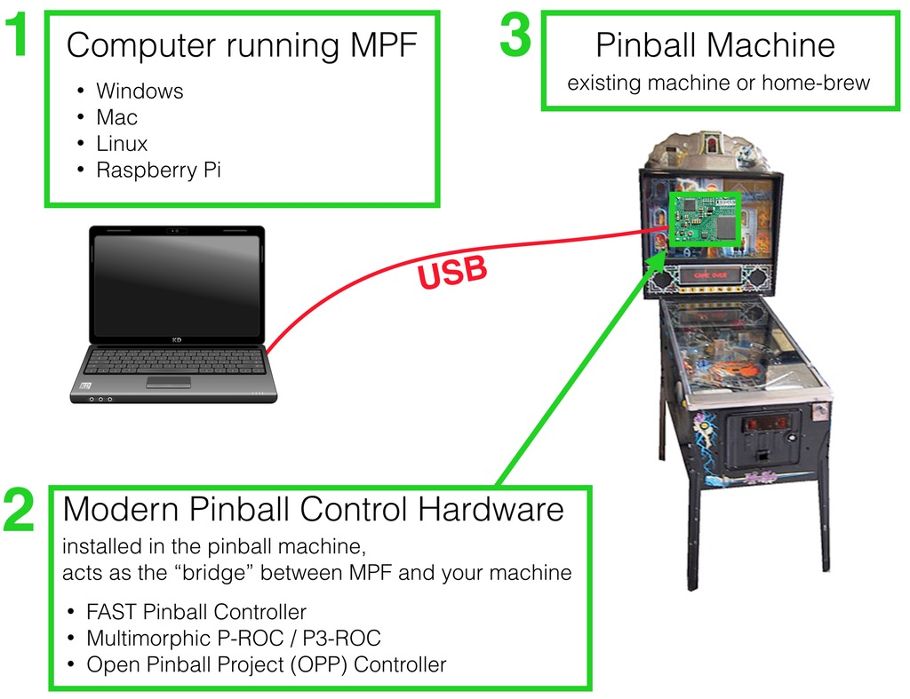

MPF Overview
============

The Mission Pinball Framework (which we call "MPF") is free and open source
software that you run on a computer (Windows, Mac, Linux, Raspberry Pi, etc.)
to control a real, physical pinball machine. (More info one what MPF is
`here <http://missionpinball.org>`_.)

Most people develop their game on their laptop, and then when they're done, transfer
it to a smaller computer permanently installed in their pinball machine.

The computer running MPF is connected to a :doc:`modern pinball control system </hardware/index>` via USB.
(MPF supports several different control systems, including FAST Pinball, P-ROC,
Open Pinball Project open source hardware, and Stern SPIKE hardware.)

You put that control system in your pinball machine, which can be a custom (home brew)
machine or an existing machine you want to reprogram.

This diagram shows how it all fits together:

The MPF software is used to configure and control everything in your machine, including:

* Pinball mechanisms (switches, LEDs, lights, motors, coils, servos, steppers,
  flippers, ball locks, diverters, etc.)
* Pinball logic (ball locks, multiball, modes, tilt, high scores, ball
  saves, ball search, extra balls, etc.)
* The display (or displays): DMD, RGB LED, and/or LCD
* Audio & sounds
* Coordinated "shows" of actions which flash lights, fade LEDs, play sounds and
  video, etc.
* Player management, including player progress, scoring, tracking towards
  goals, etc.
* Plus lots of other little things that you probably aren't even thinking about yet :)

.. note:: MPF is a work-in-progress!

   At this point MPF is a work-in-progress and not yet
   complete. It's being built by pinball-loving software developers in their
   spare time. There's a lot you can do with MPF today, but we also have a lot
   of work still to do. We're working hard though, typically adding 20-30 updates
   per week! And MPF is definitely "done" enough for you to use it today.

Read on to understand other important concepts about MPF:

.. toctree::
   :maxdepth: 1

   features
   media_controller
   config_files
   dsl_vs_programming
