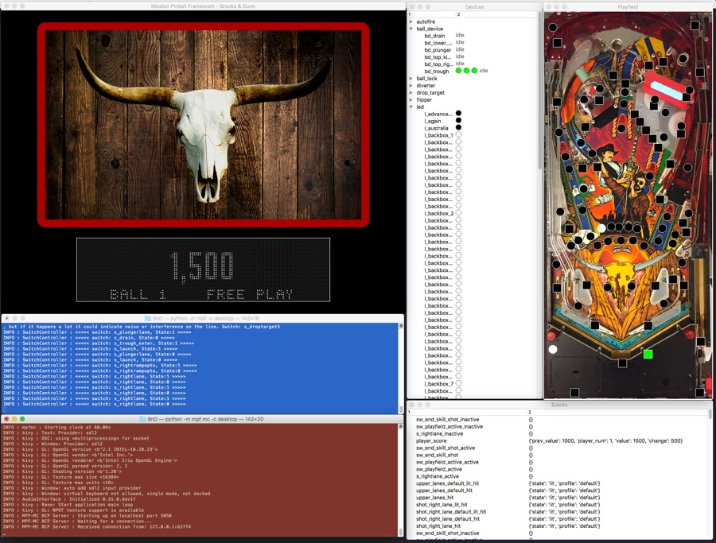

Running the MPF Monitor
=======================

#. Make sure you installed MPF Monitor first. (You need to actually
   :doc:`run the installer <installation>`. You can't just run the monitor
   from the download folder.)
#. Create a subfolder in your MPF machine folder called ``/monitor``
#. Put an image of your playfield in that folder named ``playfield.jpg``
#. Run MPF monitor from a command prompt in a new window via the command
   ``mpf monitor``. Be sure to run this from your machine folder (the same
   place where you run ``mpf both``).
#. Start MPF and MPF-MC. (You can start MPF before or after monitor is started,
   and leave the monitor running while MPF is not.)
#. MPF Monitor should connect to MPF and populate the devices tree. You can
   look through there to see the states of various devices. The columns are
   sortable and resizeable.
#. Drag-and-drop switches and LEDs onto the playfield image. When you do this,
   a config file called ``/monitor/monitor.yaml`` will be created. If you open
   that file, you'll see that x/y values of devices are stored in percentages
   instead of pixels, so they should stay in the right place even if you change
   your playfield image. The file is updated automatically. You can drag
   devices that you previously placed on the playfield too (there's a half-
   second delay so you don't accidentally move something when you're clicking
   on it.)
#. Edit ``monitor.yaml`` to remove devices from the playfield you don't want
   anymore.
#. When you resize or reposition one of the monitor windows, the window
   positioning information will be stored, so the monitor can restore the
   layout the next time you run it.

Understanding MPF Monitor folders & files
-----------------------------------------

Here's what your machine folder structure will look like when you're using
the monitor:

.. image:: images/file-structure.png

Using the MPF Monitor
---------------------

We designed MPF Monitor so that all the windows are separate (instead of a
main "parent" window), meaning you can resize them all however you want and
close the ones you don't need. The idea is that you can keep the monitor
running off to the side and still see your MPF display window as well as the
terminal windows, like this:

Running with "virtual" hardware
-------------------------------

You can use the MPF Monitor with or without a physical machine attached.

If you have a physical machine connected, be careful when toggling switches,
since it can really confuse things if a ball is sitting on a switch in
your machine and then you use the Monitor to tell MPF that the ball isn't
really there. :)

Still though it's nice to be able to "peek inside" the inner workings of
MPF even when it's connected to a physical machine, and the Monitor is
great for that.

You can also use MPF Monitor with no hardware attached using one of
MPF's :doc:`virtual platforms </hardware/virtual/index>`. Specifically the
:doc:`smart virtual platform </hardware/virtual/smart_virtual>` works great if
you're using MPF without physical hardware.

Resize switches and lights on your playfield
--------------------------------------------

Depending on your image dimensions switches and lights might be a little small
or too large.
You can change that using the ``device_size`` setting in your
``moniitor/monitor.yaml``.
The default ``device_size`` is ``0.02``.
You might try ``device_size: 0.015`` as first line in ``moniitor/monitor.yaml``
to decrease the size of all switches and lights a bit.
