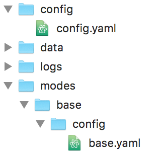

Tutorial step 14: Add your first game mode
==========================================

By this point in the tutorial you should have a "playable" game,
though it's pretty boring because there's no scoring, no modes, and
the display just shows *PLAYER X BALL X* the whole time.

So in this
step the real fun will begin as we configure our first game mode! So
far all of the configuration you've been doing has been machine-wide
configuration which was stored in the ``/config`` folder in your game's
machine folder.

All of the configuration options you added to the ``config.yaml``
applied machine-wide.

In this step, we're going to add a ``/modes`` folder to your machine
folder. Then we'll add a subfolder for each game mode, and in each
we'll create a YAML config file that controls what happens in that
specific mode.

What's cool about MPF's modes system is that all of the configuration you do for a
mode is only active when that mode is active. In fact from here on
out, almost everything you configure will be at the *mode*-level
rather than the *machine-wide* level. As we go deeper into the
tutorial and the How To guides, you'll start to get a feel for what
types of things should be in the machine-wide configuration versus the
types of things that should be in mode-specific configurations. Pretty
much all the hardware (coils, switches, lights, leds, ball devices,
platform, DMD, etc.) are configured as machine-wide settings, and then
game logic-type things (scoring, shots, sound effects, animations,
light shows, etc.) are configured as mode-specific settings.

MPF can have as many modes running at once as you want. In fact you'll
probably use this to your advantage, breaking up your game into lots
of little modes to make the programming easier. (Many of these modes
will not be "in your face" modes that the player is aware of. Things
like skill shot, combo timers, super jet counters, etc., will all be
configured as modes even though the player wouldn't think of them as
modes.)

1. Read the documentation about modes
-------------------------------------

The first step to setting up a game mode is to understand how game
modes work in MPF. So read :doc:`that documentation now </game_logic/modes/index>` to get an
overview, and then come back here for the step-by-step walk-through of
doing your first mode.

2. Set up the folders & files for your "base" mode
--------------------------------------------------

The first mode we're going to create is a mode called "base." (Don't
call it "game" because MPF has a built in mode called "game" that you
don't want to overwrite.) This "base" mode will be running at all
times while a game is in play and can be thought of as the "default"
game mode. We'll set up default shots, scoring, configure the display to
show the score, etc. Everything in the base game mode will be
available if no other higher-priority modes are running. To create the
base game mode:

#. Create a folder called ``modes`` in your machine's folder.
#. Create a subfolder your ``modes`` folder called ``base``. (You will
   ultimately create one subfolder for each mode you have, and the name of
   the folder controls the name of the mode.)
#. Inside your ``base`` folder, create a folder called ``config``. (This
   folder will hold your mode-specific config files.)
#. Inside your ``config`` folder, create a file called ``base.yaml``.
   (This is the default config file for your base mode. We use the naming
   scheme ``<mode_name>.yaml`` instead of ``config.yaml`` for these to make
   it easier to keep track of which files are which if you open a bunch
   of them at once in your editor.)

At this point your machine's folder & file structure should look like
this:

3. Add your base game mode's settings to its config file
--------------------------------------------------------

The settings that control a mode are configured the mode's own
configuration file. We do this because it allows modes to be completely
self-contained. In other words, as long as you have a mode's folder
and all its content, then you have everything you need for that mode.

So let's configure some settings for the base mode in the base mode's
config file. To do this, open your new mode's ``base.yaml`` in your code editor. Add
the config_version, then create a top-level configuration section
called ``mode:``. On the next line, indent four spaces and add the entry
``start_events: ball_starting``. On the following line, also indent four
spaces and type ``priority: 100``. Your ``base.yaml`` file should now look
like this:

.. code-block:: mpf-config

   ##! mode: my_mode
   #config_version=5
   mode:
     start_events: ball_started
     priority: 100

There are lots more settings besides ``start_events`` and ``priority``
which you can set for a mode. See the :doc:`/config/mode` for details.

The two settings we added here
should be pretty obvious. The ``start_events: ball_starting`` means that
this mode will automatically start when the MPF event
*ball_starting* is posted. (In other words, this mode will start
whenever a ball starts.) You can also enter a list of *stop_events* to
control how the mode ends, though if you don't enter one here then the
mode will automatically stop when the ball ends, so you don't have to
specify a stop event now.

The ``priority: 100`` means that everything
this mode does will have a base priority of 100. We'll create future
modes at higher priorities so they can take over the display, control
lights, filter and block scoring, etc. (You read the :doc:`documentation about modes </game_logic/modes/index>`,
right?)

Also, when you create your own modes, keep them between 100 and 1,000,000. MPF
has some built-in modes above and below those values that should stay at the
top and bottom of the priority stack.

4. Add your mode to your machine-wide config file
-------------------------------------------------

Now that you have a mode set up, you need to go back to your machine-
wide configuration file to add this new mode to the list of modes that
your game will use. At first you might think this is a bit confusing.
After all, you just created a folder and a config file for your new
mode, so why do you have to specify that mode in another location too?

The reason is we don't want to automatically include a mode in a game
just because that mode has a folder in the *modes* folder. (After all,
what if you're testing something out, or if you have multiple versions
of a mode you're playing with? It would be dangerous if MPF just
automatically loaded every mode it found.)

So instead we built MPF so
that you have to add all the modes you want to be available in a game
to a list in the machine-wide config file. To do this, go back to your
machine-wide ``config.yaml`` file (in ``<your_machine>/config/config.yaml``)
and add a top-level section called ``modes:``. (Like all the sections in
your config file, you can put this section anywhere you want in your
file. Maybe up towards the top so it's easy to find later?) Then on
the next line, type two spaces, then a dash, then another space, then
type ``base``. So now that section of your ``config.yaml`` should look
like this:

.. code-block:: yaml

   modes:
     - base

Note that it's very important that you put dashes in front of each
mode in this list? Why? Because with dashes, MPF will be able to
combine settings together in this list from different config files.

For modes that important, because MPF has several built-in modes it
uses for its own things. (For example, "attract" and "game" are both
modes, and we'll be creating future ones that you might want to use
too for tilt, volume control, game statistics, high score entry,
credits, etc.)

5. Run your game to verify your new mode works
----------------------------------------------

Be sure to save the changes to ``base.yaml`` and ``config.yaml``, and then
run your game again. For this test, you do not need to use verbose
logging since mode information is reported in the basic level of
logging. Once MPF is running, start a game and you should see something
like on the console and/or the log file when you run ``mpf both -t``:

::

   INFO : Mode.attract : Mode Starting. Priority: 10
   INFO : SwitchController : <<<<< switch: s_start, State:1 >>>>>
   INFO : SwitchController : <<<<< switch: s_start, State:0 >>>>>
   INFO : Mode.game : Mode Starting. Priority: 20
   INFO : Mode.game : Player added successfully. Total players: 1
   INFO : Mode.base : Mode Starting. Priority: 100
   INFO : SwitchController : <<<<< switch: s_trough_1, State:0 >>>>>
   INFO : SwitchController : <<<<< switch: s_shooter_lane, State:1 >>>>>
   INFO : SwitchController : <<<<< switch: s_shooter_lane, State:0 >>>>>

6. Make your base mode do something useful
------------------------------------------

We already mentioned that there are lots of different things you could
add to your base mode. For now, let's configure the display so that it
shows the player's score, as well as which player is up and what ball
it is, like this:

.. image:: images/basic_score_screen.jpg

To do this, go back to your base mode's config file (``<your_machine>/modes/base/config/base.yaml``)
and add a section called ``slide_player:``. Then add the following subsections so
your complete ``base.yaml`` looks like this:

.. code-block:: mpf-mc-config

   ##! mode: base
   #config_version=5
   mode:
     start_events: ball_starting
     priority: 100

   slide_player:
     mode_base_started:
       widgets:
         - type: text
           text: (score)
           number_grouping: true
           min_digits: 2
           font_size: 100
         - type: text
           text: PLAYER (number)
           y: 10
           x: 10
           font_size: 50
           anchor_x: left
           anchor_y: bottom
         - type: text
           text: BALL (ball)
           y: 10
           x: right-10
           anchor_x: right
           anchor_y: bottom
           font_size: 50
   ##! test
   #! start_game
   #! assert_mode_running base
   #! assert_text_on_top_slide "00"
   #! assert_text_on_top_slide "PLAYER 1"
   #! assert_text_on_top_slide "BALL 1"

We briefly touched on the ``slide_player:`` functionality earlier in
this tutorial and how you can configure it to show certain slides when
various MPF events happen.

Every time a mode starts in MPF, an event called :doc:`/events/mode_name_started`
is posted. So in this case, we set our slide
player entry to play when it sees the event ``mode_base_started`` which
means it will play that slide as soon as the base mode starts. (And
since you configured your base mode to start based on the
*ball_starting* event, this means this slide will be created and
shown whenever a new ball is started.)

You may be wondering why we don't set that slide to
play on the *ball_starting* event? The key to remember with game modes
is that all the settings in your mode-specific config file are only
active when the mode itself is active. In the case of our base mode,
the *ball_starting* event is what actually causes the mode to start.
When *ball_starting* is posted, the base mode starts and loads its
configuration. At that point that *ball_starting* event has already
happened, so if you set a slide to play within that mode then it will
never play because it doesn't start watching for that event until
after it happened. (Hopefully that makes sense?)

Anyway, if you look at the ``slide_player:`` settings, you'll see
that the slide that is shown when the event ``mode_base_started`` is posted
contains three text widgets. One that shows the score, one that shows the
player and one that shows the current ball number. Note that the ``text:`` entries
for those have have some words in parentheses.

Words in parenthesis signs are variables that are replaced in real
time when they're updated. In this case these are "player variables"
because they are values that belong to the current player. More on
using dynamic text (that is, text that automatically updated itself
as underlying values change), is :doc:`here </displays/widgets/text/text_dynamic>`.

Also note that there are some additional positioning settings, like ``x:``, ``y:``,
``anchor_x:``, and ``anchor_y:``. You can read about these in our :doc:`/displays/widgets/positioning` guide.

Finally, note that the text widget showing the score has settings for ``number_grouping:`` and ``min_digits:``.
You can read about what those do in the :doc:`documentation for the text display widget </displays/widgets/text/index>`.

7. Remove the old slide_player: ball_started entry
--------------------------------------------------

Now that you have this cool score display from your new base mode, you
can go into your machine-wide ``config.yaml`` and remove the slide_player:
entry for ball_started:. So now the slide_player: in your machine-wide
``config.yaml`` should just look like this:

.. code-block:: mpf-mc-config

   #! slides:
   #!   welcome_slide:
   #!     widgets:
   #!       - type: text
   #!         text: PINBALL!
   #!         font_size: 50
   #!         color: red
   #!       - type: rectangle
   #!         width: 240
   #!         height: 60
   #!   attract_started:
   #!     widgets:
   #!       - text: ATTRACT MODE
   #!         type: text
   slide_player:
     init_done: welcome_slide
     mode_attract_started: attract_started
   ##! test
   #! advance_time_and_run .1

What if it didn't work?
-----------------------

+ Make sure you actually start a game. Remember that this new base
  mode is only active when a ball starts from a game that's in progress,
  so you won't see the mode until a game starts. (If you're not able to
  start a game, check the troubleshooting tips in the previous step.)
+ If you get some kind of crash or error, specifically any errors that
  mention anything about "config" or "path," double-check that you put
  all the files in the proper locations back in Step 2. (A common
  mistake is to put `base.yaml` in the `/modes/base` folder rather than the
  `/modes/base/config` folder.)

Check out the complete config.yaml file so far
----------------------------------------------

If you want to see a complete ``config.yaml`` file up to this point, it's in the ``mpf-examples/tutorial/step_14``
folder.

You can run this file directly by switching to that folder and then running the following command:

.. code-block:: doscon

   C:\mpf-examples\tutorial_step_14>mpf both
