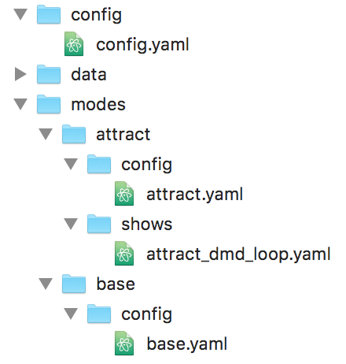

Tutorial step 16: Create an attract mode display show
=====================================================

Now that we have a running game and some basic scoring, let's continue
to make the display more useful by creating a slide show that plays during the attract mode
and cycles through a few different slides. ("GAME OVER", "PRESS START", ... that sort of thing.)

1. Create an attract mode folder structure
------------------------------------------

So far it looks like your game only has one mode. (The *base* mode you
created a few steps ago.) But MPF actually has a few built-in modes
that it uses to do its thing. For example, there's a mode called
"attract" which runs the attract mode (including watching for the
start button press to start a game), and there's a mode called "game"
which actually runs your games. (You may have noticed these modes in
your logs. *Attract* runs at priority 10 and *game* runs at priority
20.)

Even though the attract mode is built-in, you can still create an
attract mode folder and an attract mode config which enable you to
extend the attract mode for your own use. So let's do that now.

Go into your machine's ``/modes`` folder (which should only have your base
folder in it) and create a new folder called ``attract``. Now you should
see two folders in it:

Now create a ``/config`` folder in your attract
folder, and then create a new config file called ``attract.yaml``. So the attract
folder is pretty much just like the base folder, with the file ``attract.yaml``
used to control the settings that will be used when the attract mode is active.

Finally, create a folder called ``/shows`` in your new attract mode folder,
and inside that folder, create a new file called
``attract_display_loop.yaml``.

Your new machine folder structure should look like this:

2. Edit your show yaml file
---------------------------

MPF has the ability to run "shows" which are coordinated series of
lights, sounds, slides, flashers, images, videos, etc. These show
files also use the ``.yaml`` file format, though they're different than
the yaml config files. You can name the show whatever you want. In
this case we called it ``attract_display_loop.yaml`` since that pretty much
describes what it does.

Note that we put this show file in a folder
called "shows" in our attract mode folder. Technically you can play
any show from any mode (and you could add a machine-wide ``/shows``
folder if you want), but we prefer to add the shows used by a mode inside
that mode's ``/shows`` folder since it keeps everything from one mode together.

Here's a complete sample ``attract_display_loop.yaml``
file you can use as a starting point:

.. code-block:: mpf-mc-config

   ##! show: attract_display_loop
   #show_version=5

   - duration: 3s
     slides:
       awesome_slide:
         widgets:
         - type: text
           text: YOU ARE AWESOME
           font_size: 50
         transition:
           type: push
           duration: 1s
           direction: left

   - duration: 3s
     slides:
       press_start:
         widgets:
         - type: Text
           text: PRESS START
           animations:
             pre_show_slide:
             - property: opacity
               value: 0
               duration: .5s
             - property: opacity
               value: 1
               duration: .5s
               repeat: false
         - type: Text
           text: FREE PLAY
           color: green
           y: 10
           anchor_y: bottom
         transition:
           type: move_in
           duration: 1s
           direction: right

   - duration: 3
     slides:
       mission_pinball:
         widgets:
         - type: Text
           text: MISSION PINBALL
           color: red
         transition:
           type: move_in
           duration: 1s
           direction: top

   - duration: 3
     slides:
       last_game_score_slide:
         widgets:
         - type: text
           text: LAST GAME
           font_size: 50
           y: 60%
         - type: text
           text: (machine|player1_score)
           number_grouping: true
           min_digits: 2
           font_size: 50
           y: 40%

   ##! mode: attract
   #! show_player:
   #!   mode_attract_started: attract_display_loop
   ##! test
   #! assert_text_on_top_slide "YOU ARE AWESOME"
   #! advance_time_and_run 3
   #! assert_text_on_top_slide "PRESS START"
   #! assert_text_on_top_slide "FREE PLAY"
   #! advance_time_and_run 3
   #! assert_text_on_top_slide "MISSION PINBALL"
   #! advance_time_and_run 3
   #! assert_text_on_top_slide "LAST GAME"

First, notice the first line is ``#show_version=5``. This is similar to the
config_version in config files, except since this is a show file, it's "show_version".

Next, notice that the show file is broken into steps, each beginning with a
dash and then a ``duration:`` entry. The ``duration:`` entry controls how long each step is.
The default unit for this value is seconds, so ``duration: 3`` is valid, though you can enter
standard time strings like ``duration: 3s`` or ``duration: 300ms``, etc.

By the way, when you play back a show, you can set the playback speed. So even though
all the steps are 3 seconds long in our example show, when you play the show, you could
(for example), set the playback speed to 2.0, and each step would be 1.5 seconds instead
of 3 (since it's playing 2x as fast).

There's a whole section of documentation on :doc:`shows </shows/index>`, so review that
at some point for all sorts of details about show files, formats, etc.

In addition to the ``duration:`` setting in each step, also notice that each step has a
``slides:`` setting. The format and content of the ``slides:`` section of a show is
identical to the ``slide_player:`` section in a config file. (In the future you'll see
this applies to other "players"; for example, ``light_player:`` in a config file is the same as
``lights:`` in a show, ``sound_player:`` in a config file is the same as ``sounds:`` in a show, etc.)

Then in the ``slides:`` section of each step, we've added a slide name. These slides are named
``awesome_slide``, ``press_start``, and ``mission_pinball`` in the example above. The slide names
don't really matter, but since none of these slides have been defined yet, we add a ``widgets:``
section to each one and define them here. (The slides are only created once, the first time they're
displayed. After that they are kept in memory so they can be used over and over. They're only
removed from memory when the attract mode stops.)

Also notice that we added ``transition:`` settings which control how one slide transitions
to the next. Without transitions, the new slide appears instantly. But with transitions, we
can make one slide move in from the side, or cross fade, etc.

The last slide deserves special mention - it displays the score of the previous game. Player variables
such as score are only valid during a game and lose their value once the game ends. To allow access to
the score of a previous game, MPF saves this player variable to a machine variable which can be
accessed outside the running game.  A discussion of this and other machine variables is found
:doc:`here </machine_vars/index>`.

3. Configure your show to play automatically
--------------------------------------------

Now that you've created your show, we need to make it so it plays. In this case we want
this show to play whenever the attract mode is running. To do this, go
back to the config file for the attract mode (
``<your_machine>/modes/attract/config/attract.yaml``) and add the following:

.. code-block:: mpf-mc-config

   ##! show: attract_display_loop
   #! - duration: .1
   #!   events: ok_super
   ##! mode: attract
   #config_version=5

   show_player:
     mode_attract_started: attract_display_loop
   ##! test
   #! mock_event ok_super
   #! advance_time_and_run .1
   #! assert_event_called ok_super

Note that we don't need a ``mode:`` section here because those settings
are already configured in the default attract mode settings folder
contained inside of MPF. So instead all we need to do is add a
``show_player:`` entry. Like the ``slide_player:`` we've used in the past,
the ``show_player:`` section contains sub-sections for MPF events, and when that event is
posted the shows underneath it are started.

In this case we're going
to start the show when the *mode_attract_started* event is posted.

You can also use the ``show_player:`` section of a config to set events that stop shows,
but shows that are started from modes automatically stop when that mode stops. (The beauty
of mode-based configs!) So in this case, the ``attract_display_loop`` will automatically
stop when the attract mode stops (which it does when a game starts).

4. Remove the attract mode stuff from your machine config
---------------------------------------------------------

One last thing you should do here while you're at it is go back into
the machine-wide config ``<your_machine>/config/config.yaml`` and remove the
attract_started slide from the ``slides:`` section, and the ``mode_attract_started``
entry from your ``slide_player:`` section.

OLD machine-wide config (partial):

.. code-block:: mpf-mc-config

   # old
   slides:
     welcome_slide:
       widgets:
         - type: text
           text: PINBALL!
           font_size: 50
           color: red
         - type: rectangle
           width: 240
           height: 60
     attract_started:
       widgets:
         - text: ATTRACT MODE
           type: text

   slide_player:
     init_done: welcome_slide
     mode_attract_started: attract_started
   ##! test
   #! assert_slide_on_top attract_started

NEW machine-wide config:

.. code-block:: mpf-mc-config

   slides:
     welcome_slide:
       widgets:
         - type: text
           text: PINBALL!
           font_size: 50
           color: red
         - type: rectangle
           width: 240
           height: 60

   slide_player:
     init_done: welcome_slide
   ##! test
   #! assert_slide_on_top welcome_slide

The reason we remove this is because it's not necessary now that we have our new
attract mode display show running.

Plus, even if you don't remove this entry, the original "ATTRACT MODE" text from the
machine-wide config won't show up anymore. Why? Because the attract mode runs at
Priority 10, and the machine-wide config is Priority 0. So the display show from the
attract mode config will show on top of the slide from the machine-wide config, so we
may as well remove the machine-wide one.

Now when you run your game via ``mpf both``, you should see the attract mode display show.
Then when you press Start (or the ``S`` key), everything else should proceed as it did before.

If you play through a complete game (3 balls), then when the game is over, you should see the
attract mode display show start up again.

Check out the complete config.yaml file so far
----------------------------------------------

If you want to see a complete ``config.yaml`` file up to this point, it's in the ``mpf-examples/tutorial/step_16``
folder. You can run it be switching to that folder and running ``mpf both``:

.. code-block:: doscon

   C:\mpf-examples\tutorial_step_16>mpf both
