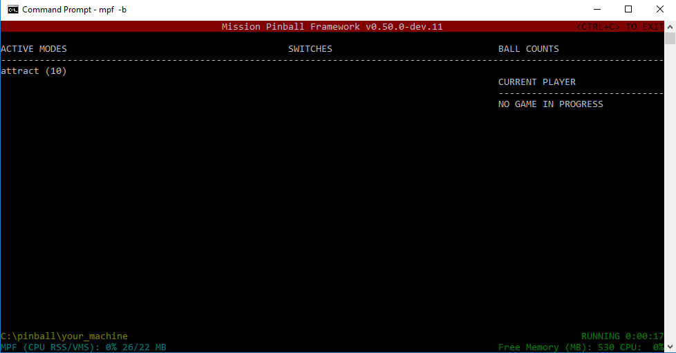
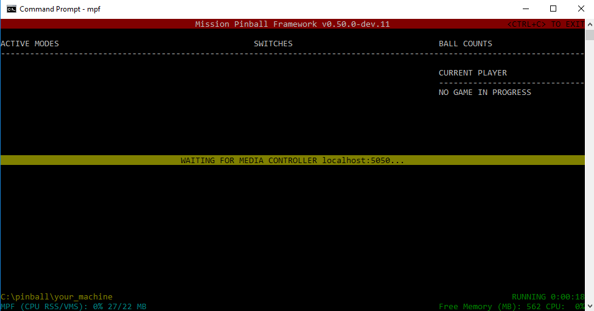

Tutorial step 2: Create your machine folder
===========================================

Okay, so MPF is installed and you're able to run *Demo Man*. Great!
Now it's time to create the folders and files for your own game.

1. Understand the "machine folder" concept
------------------------------------------

In MPF, we use the term *machine folder* to describe the folder that
contains all the files for your game. This includes config files,
images, sounds, videos, settings, audits, modes, and everything else.

The machine folder is organized into subfolders to keep everything straight.

MPF machine folders are portable, meaning you can grab a machine folder from one
computer and run it on another—-even if it's a different platform.
(Windows to Linux, Mac to Windows, etc.)

.. note::

   In "MPF speak", we call these "machine" folders, not "game" folders. The reason is
   because in MPF, a "game" is an actual game-in-progress running on a machine (with players,
   balls, scores, etc.). So you're really creating a pinball *machine* config, not a pinball
   game config.

2. Create your machine folders
------------------------------

Okay, so let's get started with your own game's machine folder. The
first step is to create an empty folder somewhere. (Anywhere you want.)
You can name this folder whatever you want too.

Let's use the name "your_machine", and let's add that folder to the ``C:\pinball``
folder, like this:

.. code-block:: doscon

   C:\pinball\your_machine

Obviously if you're on Mac or Linux, you won't have a C: drive, but that doesn't matter
for the tutorial. Just create a new folder empty folder somewhere and name it whatever you
want.

Throughout this tutorial we'll refer to this as "your machine folder".

Next create a subfolder in your new machine folder called ``\config``. This is where your machine
configuration files will live. This folder should be inside your machine folder, like this:

.. code-block:: doscon

   C:\pinball\your_machine\config

3. Create your machine config file
----------------------------------

Now let's actually create a file which will contain all the configuration for your pinball
machine. To do that, create a file called ``config.yaml`` in your machine folder's */config*
sub-folder. This file should be here:

.. code-block:: doscon

   C:\pinball\your_machine\config\config.yaml

Note that if you're on Windows and you just right-click and select *New > Text Document*,
make sure that Windows Explorer is configured to show file extensions
so you actually create a file called ``config.yaml`` and not ``config.yaml.txt``. (That's in the "View" menu of Explorer.)

4. Add #config_version=5 to the top of your config file
-------------------------------------------------------

The first thing you need to do when you create any new config file for MPF is to add an entry on the very top line that
tells MPF what “version” of the MPF config spec you’re using for the file you’re creating.

So just open the file (with a text editor or a free tool like `Atom <http://atom.io>`_, `Sublime <https://www.sublimetext.com/>`_, or  `Notepad++ <https://notepad-plus-plus.org/>`_)
and then add that to the top of the file and save it.
If you are familiar with an IDE such as VSCode or PyCharm/IntelliJ we suggest
that you install the :doc:`MPF language server </tools/language_server/index>`
which supports auto-completion, syntax and error highlighting, context help,
go to definition and more.

For MPF |version|, that should look like this:

.. code-block:: yaml

   #config_version=5

Be sure to enter this exactly as it's shown here, with no spaces around the equal sign.

This line tells MPF which version of the config spec you have. That way if a future version of MPF
requires changes to a config file, it can automatically recognize older files and update them.

The current version of the config files is ``5`` which is what’s used with MPF 0.50 and newer, so that’s what we’re adding
here.

At this point, your environment should look like this:

.. image:: images/machine_config_folder.png

Note the folder structure, the location of the ``config.yaml`` file, and the ``#config_version=5`` as the only
contents of that file.

5. Run your game!
-----------------

Believe it our not, it's time to run your game! Simply open a console window and change to your machine
folder, and run ``mpf -b``, like this:

.. code-block:: doscon

   C:\pinball\your_machine>mpf -b

Again, enter it as shown, with a space between ``mpf`` and ``-b``. (The ``-b`` option tells MPF not to try to connect
to a media controller for display and sound since we haven't set that up yet.)

You should get results that look something like this:

This is MPF's default display when it's running. Don't worry--this is not what your machine's players will see when
they play! :) We'll set that up later. This is more for you while you're building your MPF config.

Notice a few things on this console display:

* The version of MPF that's running is in the red bar along the top.
* Any game modes that are running are in the "ACTIVE MODES" section (which is just the attract mode for now since we
  haven't set anything else up).
* A list of switches and their states in in the middle "SWITCHES" section (which is also empty since we don't have
  any switches setup yet).
* A list showing which devices are holding balls is in the "BALL COUNTS" section (also blank).
* The current player's number, score, and ball in the "CURRENT PLAYER" section (also blank).
* The machine folder path (in yellow in the lower left corner)
* How much CPU and memory MPF is using. (CPU is the percentage which is 0% in the screen shot which makes sense since
  your config is blank and MPF isn't doing anything!) The memory use is the memory used (RSS), then a slash, then
  the memory size (total that it could use). In the screen shot, we see MPF is using 4MB but could use as much as 22MB.
* How long MPF has been running (hours:minutes:seconds) in green in the lower right
* How much total free memory your computer has (530 MB in the screen shot)
* How much total CPU is busy on your computer overall (also 0% in the screen shot)

At this point you can pretty much just sit there and watch MPF forever, but it won't ever do anything until you add more
to your config file.

To stop MPF, hit :kbd:`CTRL+C` . That should take you back to the command window.

At this point you're all set! If your machine is working like this, go ahead and move on to the next step.
However if you got something else on your display or some kind of error or crash, read on below...

What if it didn't work?
-----------------------

If you don't get an output that shows the attract mode running like the example above, there could be a few reasons for
this, depending on the error.

If you get a crash with a message about a "Config file version mismatch", like this:

.. code-block:: doscon

   C:\pinball\your_machine>mpf -b
   Config file version mismatch: C:\pinball\your_machine\config\config.yaml
   Traceback (most recent call last):
     File "c:\python34\lib\site-packages\mpf\commands\game.py", line 202, in __init__
       MachineController(mpf_path, machine_path, vars(self.args)).run()
     File "c:\python34\lib\site-packages\mpf\core\machine.py", line 146, in __init__
       self._load_config()
     File "c:\python34\lib\site-packages\mpf\core\machine.py", line 405, in _load_config
       self._load_config_from_files()
     File "c:\python34\lib\site-packages\mpf\core\machine.py", line 425, in _load_config_from_files
       config_type='machine'))
     File "c:\python34\lib\site-packages\mpf\core\config_processor.py", line 24, in load_config_file
       config = FileManager.load(filename, verify_version, halt_on_error)
     File "c:\python34\lib\site-packages\mpf\core\file_manager.py", line 167, in load
       halt_on_error)
     File "c:\python34\lib\site-packages\mpf\file_interfaces\yaml_interface.py", line 255, in load
       raise ValueError("Config file version mismatch: {}".format(filename))
   ValueError: Config file version mismatch: C:\pinball\your_machine\config\config.yaml

This means you don't have ``#config_version=5`` in the top line of your config file. (Make sure you include the hash
mark as part of that.)

If the following line at the end of your log and nothing more happens you probably started mpf with mc (i.e. by omitting the `-b` switch).
This can be fixed by either running `mpf -b` or by making sure that the media controller is running.

.. code-block:: console

   BCPClientSocket.local_display : Connecting BCP to 'local_display' at localhost:5050...

If you get an error that says ``Could not find machine folder: 'None'``, that means that you ran MPF from the
wrong folder. For example:

.. code-block:: doscon

   C:\pinball\your_machine\config>mpf
   Error. Could not find machine folder: 'None'.

This happens because the command prompt is in the child "config" folder, rather than the base machine folder. So ``cd ..``
up one level and try again.

.. code-block:: doscon

   C:\>mpf
   Error. Could not find machine folder: 'None'.

Again, same thing here. The example above is in the root of C: which is not a valid machine folder. (It is possible to
run a machine from another folder via command line options which is why this error says it couldn't find the machine "None",
but for now just know that you need to run MPF from the root of your machine folder.)

It's possible you might also get an error about "mpf" not being recognized. For example, on Windows:

.. code-block:: doscon

   C:\pinball\your_machine>mpf
   'mpf' is not recognized as an internal or external command,
   operable program or batch file.

Or on Mac or Linux:

.. code-block:: console

   $ mpf
   -bash: mpf: command not found

In this case you probably don't have MPF installed right, so jump back to the installation part of the docs and
follow that again.

If you see a yellow bar and do not see the attract mode in the list of active modes, like this:

That means you did not including the ``-b`` option when you ran MPF. (e.g. you probably just ran ``mpf`` instead of
``mpf -b``. In this case, MPF is trying to connect to the media controller (for your game's graphics and sounds), but
since we haven't gotten that far in the tutorial, it doesn't exist and therefore MPF won't be able to connect to it.
