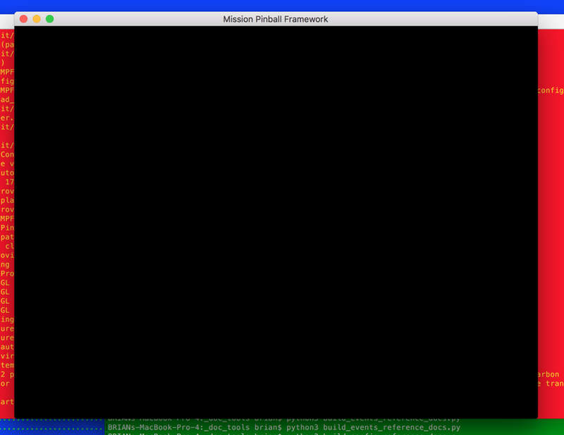
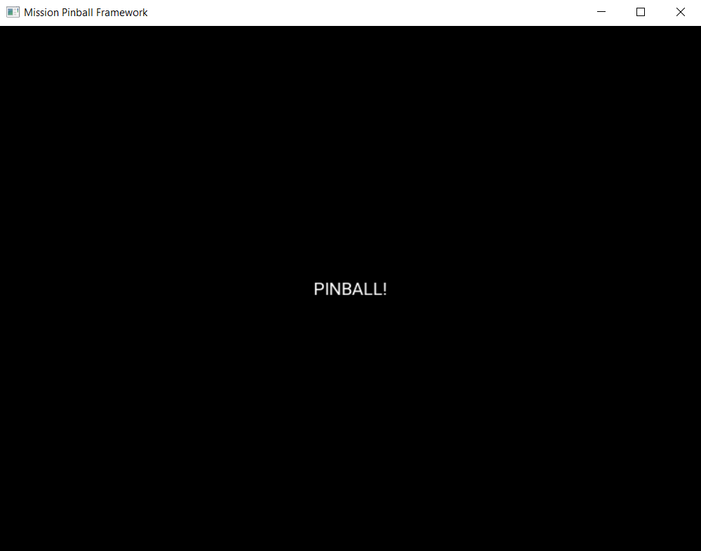
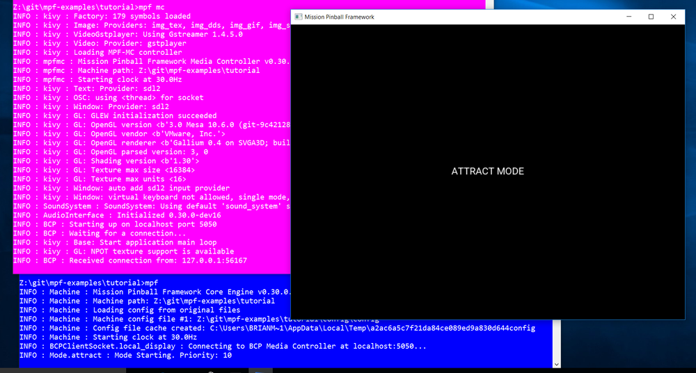
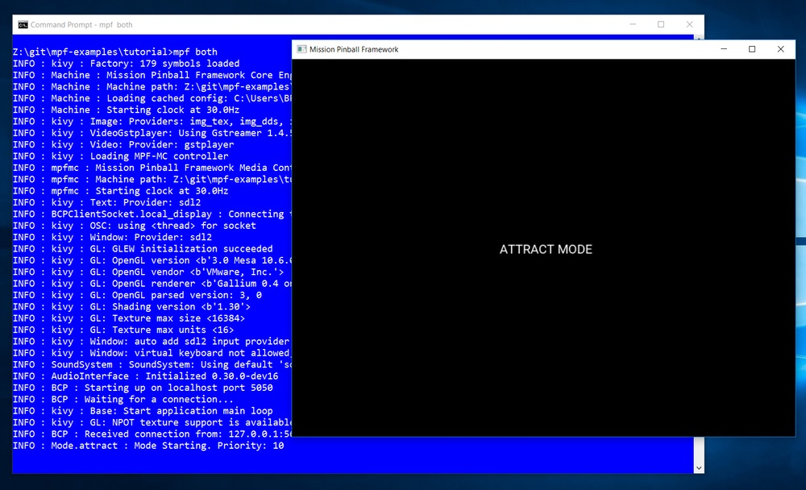

Tutorial step 5: Add a display
==============================

In this step, we're going to add a graphical on-screen window which
will help show what's happening in your machine as it runs. If you're
planning to put an LCD display in the backbox of your machine, this is
what we'll set up now. And if you want to use a physical DMD (whether it's
an older-style mono DMD, or a newer full color LED-based DMD), you'll
be able to use the screen window we set up in this step to show a software
version of your DMD.

Regardless of what type of display you want to use in your final machine,
follow this step in the tutorial and then you can set up your
final display later.

1. Run the media controller to see how it works
-----------------------------------------------

Remember from the MPF :doc:`/start/index` section (you read that, right?) that MPF
is actually two separate pieces--the *game engine* and the *media controller*.

Up until this point in the tutorial, we've been running the MPF game engine only.
In this step, since we're adding a display, we'll be working with the media
controller.

So first, let's run the MPF media controller from your machine folder so you can
see how it works. You do that with the ``mpf mc`` command, like this:

.. code-block:: doscon

    C:\pinball\your_machine>mpf mc

When you do this, you should see an 800x600 popup window that's completely black with the title
"Mission Pinball Framework". Here's an example from Mac OS X:

You can close this window (and exit the MPF MC) by hitting the ``Esc`` key. (If this doesn't
work, click your mouse in the popup window to give it focus and try again.)

You can also exit the MPF MC and close the popup window from the command line via ``CTRL+C``.

2. Add a "display" to your config file
--------------------------------------

Now that you know how to run the MPF media controller (or "MPF-MC", as we often call it), let's configure
your machine config so that window actually shows some content.

The MPF game engine and MPF-MC both read the same configuration files, so we'll be editing the same
``config.yaml`` file we've been working with all along.

The first step is to create a "display" in your MPF config, which is like an internal representation
of a blank canvas that holds graphical content which can be shown on an LCD screen or a DMD.
The MPF-MC can have multiple display canvases at the same time, and you can map different ones to
different physical displays. (This means ultimately you can support multiple displays at the same time.)

The only setting for each display we need to worry about now is the height and width, both defined in terms of the
number of pixels. So for now, create a single display called "window" set to 800x600 pixels. To do this, add
the following to your ``config.yaml`` file:

.. code-block:: mpf-mc-config

   displays:
     window:
       width: 800
       height: 600
   ##! test
   #! advance_time_and_run .1

Make sure that the word ``displays:`` has no spaces in front of it, since it's a top-level config item.

Note that in the example above, we used 2 spaces for the indentation instead of 4. That's fine, YAML doesn't care. (And
you can even mix-and-match in the same file.) The only spacing thing that matters is items at the same level are
indented the same number of spaces (like "width" and "height"). Also, no tabs.

The configuration above is creating a display called "window" which MPF will automatically map to the on screen popup
window. There are more options here (especially when you get to using multiple displays) covered in the
:doc:`/displays/index` section of the documentation, but we don't need to worry about that.

Also, again, if your machine is going to use a physical DMD (whether mono or color), or if you want to have the
"dot look" of an on-screen DMD on an LCD screen, for now just follow along the tutorial as is, and then you can read
full display documentation afterwards to configure your displays. Everything we do in
the tutorial will transfer over even if you ultimately use a different kind of display.

3. Add a slide & a text widget
------------------------------

Ok, so now we have a display called "window". If you run ``mpf mc``, you will still see the black popup window (just
like Step 2) since we haven't actually told the window to show anything. So in this step, we're going to add some
content to the window display, starting with some simple text.

To do this, you need to understand some basic concepts about how the display system works in the MPF media
controller.

Since the folks who originally started MPF spend a lot of time giving presentations, the display concepts and
terminology are pulled from presentation software like Microsoft PowerPoint or Apple Keynote. So if you're
familiar with those, you should be familiar with the display concepts in the MPF MC.

First is the concept of :doc:`slides </displays/slides/index>`. Just like a
PowerPoint presentation, an MPF display
is essentially a window frame that shows slides. Many slides can exist, but only one is shown at a time, and that
slide takes up the entire display. (Just like how a PowerPoint slide takes up the whole display when you're playing the
slide show.)

In MPF-MC, when one slide switches to another, there can be an animated "transition", like fade, push in, move out,
etc.

A slide is like a blank canvas that you put things on. The "things", in this case, are called
:doc:`widgets </displays/widgets/index>`.
MPF has different types of widgets, for example, text, images, videos, shapes, lines, etc. When you put a
widget on a slide, you can specify all sorts of properties, like the size, position, alignment, colors, etc.

One slide can have lots of different widgets, and you can specify the order widgets are drawn to control
which ones are "on top" of others. You can add and remove widgets from existing slides at any time, and you can
also animate widget properties, meaning you can change the opacity (to make them flash), or you can
animate their position, size, etc.

All of this will become more clear throughout the tutorial, so let's just jump right in.

In order to show some text, we first have to create a slide, add a text widget to that slide, and make that slide the
active slide on the display.

So first let's create the slide. There are several ways to do this, so we're just going to show you one way
here and then you can read the full documentation on :doc:`slide </displays/slides/index>` later.

In MPF, all slides have names. You can define slides in the ``slides:`` section of the config. So let's create a
slide called "welcome_slide", like this:

.. code-block:: mpf-mc-config

   slides:
     welcome_slide:
   ##! test
   #! advance_time_and_run .1

Now let's add a ``widgets:`` section under that slide, then under that, we'll start creating some widgets.

.. code-block:: mpf-mc-config

   slides:
     welcome_slide:
       widgets:
   ##! test
   #! advance_time_and_run .1

You can add as many widgets as you want to a slide. (And it's pretty common for slides to be made up of lots of
widgets). For now let's add a text widget that reads "PINBALL!". Do this by adding the following to your config:

.. code-block:: mpf-mc-config

   slides:
     welcome_slide:
       widgets:
         - type: text
           text: PINBALL!
   #! slide_player:
   #!   show_slide_event: welcome_slide
   ##! test
   #! post show_slide_event
   #! advance_time_and_run .1
   #! assert_slide_on_top welcome_slide
   #! assert_text_on_top_slide PINBALL!

There are a few things going on there.

First, notice that before the word ``type:``, there's a dash (hyphen), followed by a space. This is how you specify a
list of items in YAML. (Think of it kind of like the YAML version of a bullet list.) You need to do this when adding
widgets to a slide since a single slide can have more than one widget, so the dash tells the YAML file (and MPF-MC)
where the settings for one widget end and the next begin.

Second, the space AFTER the dash is important. WRONG: ``-type: text``  RIGHT: ``- type: text``

The ``type: text`` line is telling MPF-MC that this entry is for a text widget. And the
``text: PINBALL!`` is setting the text for this widget to be "PINBALL!". (For now we're just hard-coding the text to be
"PINBALL!", but in the future we'll look at how you can use dynamically-updating text (like for the player score) that
updates automatically whenever it changes.

Now run ``mpf mc`` and what do you see?

A blank window again! :(

The reason the window is still empty is because even though we created a slide (called "welcome_slide") and we added a
widget to that slide, we didn't actually configure MPF-MC to *show* that slide. So let's do that now.

4. Add a slide_player config
----------------------------

Next, create a new section in your config called ``slide_player:``. The slide_player watches for certain events to
occur, and when they do, it "plays" a slide.

To see this in action, add the following section to your machine config:

.. code-block:: mpf-mc-config

   #! slides:
   #!   welcome_slide:
   #!     widgets:
   #!       - type: text
   #!         text: PINBALL!
   slide_player:
     init_done: welcome_slide
   ##! test
   #! advance_time_and_run .1
   #! assert_slide_on_top welcome_slide
   #! assert_text_on_top_slide PINBALL!

What this is doing is saying, "When the event called *init_done* happens, play the slide called *welcome_slide*." The
*init_done* is an event that's posted by MPF-MC at the earliest possible point when it is ready after it initially starts
up (literally it's saying "the MC is ready"). So what we're doing here is telling MPF-MC to show our welcome slide as
soon as it can. (Check out the :doc:`events </events/index>` documentation for details on what events are.)

To verify, run ``mpf mc`` again, and hopefully you see something like this:

Cool! We have text! Of course it's kind of small, and white, but it confirms that everything is working. Again,
what's actually happening here is:

* You have a display called "window",
* which is showing a slide called "welcome_slide",
* because the slide_player was configured to show that slide when the "init_done" event happened, and
* that slide has a single widget,
* which is a text widget with its text set to "PINBALL!".

There are lots of settings for each widget type that you can use in your config file. Since this is a text widget, we
can look at the :doc:`documentation for text widgets </displays/widgets/text/index>` to see what options we have.

For example, let's change the font size and the color, by adding ``font_size:`` and ``color:`` lines:

.. code-block:: mpf-mc-config

   slides:
     welcome_slide:
       widgets:
         - type: text
           text: PINBALL!
           font_size: 50
           color: red
   #! slide_player:
   #!   show_slide_event: welcome_slide
   ##! test
   #! post show_slide_event
   #! advance_time_and_run .1
   #! assert_slide_on_top welcome_slide
   #! assert_text_on_top_slide PINBALL!

Now when you run ``mpf mc`` again, you should see this:

.. image:: images/mc_pinball_2.png

By default, the widget is centered in the slide, but you can play with different settings to position it wherever you
want. (Check out :doc:`/displays/widgets/positioning` for details.)

5. Add a second widget
----------------------

We already mentioned that you can add as many widgets as you want to a slide and that there are lots
of different kinds of widgets. Let's add a second widget to your welcome slide. This one will be a
rectangle which appears behind the word "PINBALL!".

.. code-block:: mpf-mc-config

   slides:
     welcome_slide:
       widgets:
         - type: text
           text: PINBALL!
           font_size: 50
           color: red
         - type: rectangle
           width: 240
           height: 60
   #! slide_player:
   #!   show_slide_event: welcome_slide
   ##! test
   #! post show_slide_event
   #! advance_time_and_run .1
   #! assert_slide_on_top welcome_slide
   #! assert_text_on_top_slide PINBALL!

Again, note that you use a dash followed by a space to denote the start of the second widget. This
widget's type is "rectangle", with its height and width specified. Since we're not specifying any
position, it will be centered (just like the text widget), and since we're not specifying a color,
it will be white.

Now when you run ``mpf mc``, you should see this:

.. image:: images/mc_pinball_3.png

Note that the word "PINBALL!" is "on top" of the white rectangle. That's because the order of the
widgets on the display matches the order they're entered into the config file. So in this example,
since the text widget comes first in the list of widgets for the welcome slide, the text widget is
on top. If you switch the order and run ``mpf mc`` again, you'll just see the white rectangle with
no text, since the rectangle would be "on top" and it would completely cover the PINBALL! text.

6. Run MPF-MC and the MPF game engine at the same time
------------------------------------------------------

Ok, so now you're able to run the media controller to get some widgets to show up. But so far,
you were just running ``mpf mc`` which is running the media controller by itself, without the MPF
game engine running.

So in this step, we're going to run them both at the same time.

The first thing you need to do is add another slide to your config for the MC to play, and this time
we'll make that slide play on a different event.

So in your ``slides:`` section, add another slide called ``attract_started``, like this:

.. code-block:: mpf-mc-config

   slides:
     welcome_slide:
       widgets:
         - type: text
           text: PINBALL!
           font_size: 50
           color: red
         - type: rectangle
           width: 240
           height: 60
     attract_started:
       widgets:
         - text: ATTRACT MODE
           type: text
   #! slide_player:
   #!   show_slide_event: welcome_slide
   ##! test
   #! post show_slide_event
   #! advance_time_and_run .1
   #! assert_slide_on_top welcome_slide
   #! assert_text_on_top_slide PINBALL!

Note that ``attract_started:`` is indented the same number of spaces as ``welcome_slide:``. Also
note that in the attract_started slide, we switched the order of ``text:`` and ``type:``. We did that
here just to demonstrate that the order of settings in the config doesn't matter.

If you run this, nothing different will happen because all we did here in the slides section is
define a slide. We need to use the ``slide_player:`` section to actually play the slide when some
event happens.

So next, go to the ``slide_player:`` section of your config and add an entry for the event
``mode_attract_started``. (This is the event that is posted whenever a mode starts, in the form of
*mode_<mode_name>_started*.)

By the way, if you're wondering how we know what events to use, there's an :doc:`event reference </events/index>` in the
documentation which has a list of all the events in MPF as well as descriptions of when
they're posted. You can use any of these as triggers for your slides via the ``slide_player:``.

Anyway, add the ``mode_attract_started`` to your ``slide_player:`` like this:

.. code-block:: mpf-mc-config

   #! slides:
   #!   welcome_slide:
   #!     widgets:
   #!       - type: text
   #!         text: PINBALL!
   #!         font_size: 50
   #!         color: red
   #!       - type: rectangle
   #!         width: 240
   #!         height: 60
   #!   attract_started:
   #!     widgets:
   #!       - text: ATTRACT MODE
   #!         type: text
   slide_player:
     init_done: welcome_slide
     mode_attract_started: attract_started
   ##! test
   #! advance_time_and_run .1
   #! assert_slide_on_top attract_started
   #! assert_text_on_top_slide "ATTRACT MODE"
   #! start_game
   #! post show_slide_event
   #! advance_time_and_run .1
   #! assert_slide_active welcome_slide

Again, this is saying you want the slide called "attract_started" to play when the event called
"mode_attract_started" happens.

Now run ``mpf mc`` again. At this point you should see the welcome slide with the PINBALL! text.
(You see the welcome slide because the MPF game engine isn't running, and the game engine is responsible
for starting and stopping
modes. So no game engine means no attract mode, and no attract mode means no *attract_mode_started*
event, which means no *attract_started* slide.)

Now open a second terminal window and switch into your game folder and launch the MPF game engine.
Remember from prior steps that we ran MPF with the ``-b`` option which told MPF to *not* try to
connect to the MPF-MC. But now we have the MC running, so we want to run MPF without ``-b`` so it connects.

So this time, just run ``mpf -t``, like this:

.. code-block:: doscon

    C:\pinball\your_machine>mpf -t

We added ``-t`` to disable the text ui on MPF because it might hide errors.
When you run MPF, after some stuff scrolls by, you should see the *attract_started* slide replace
the *welcome_slide*, like this:

So now MPF is running, it's talking to the MC, and you have the world's most boring attract mode!

To quit MPF, just make sure the graphical window has focus and hit the ``Esc`` key. That should cause
both the MPF game engine and the MC to exit. (If they hang for some reason, you can click in the console
window of the one that's hanging and press ``CTRL+C`` to kill it.)

Note that in the screen shot above, the colors of the command windows were changed. The magenta window is
where ``mpf mc`` was run, and the blue window is where ``mpf`` was run.

Since the *attract_started* slide only has one widget, and since all we did with that widget is
specify text (but not size, color, position, font, etc.), we just get the default text properties
which are small, arial, and white.

7. Launching the MPF game engine and MPF MC at the same time
------------------------------------------------------------

In the previous step, you used two separate console windows to launch ``mpf mc`` and ``mpf`` separately.
(If you do this, by the way, you can launch either one first and it will wait for the other one.)

That's nice for learning purposes, but kind of annoying for everyday use. Fortunately there's a command
called ``mpf both`` which launches both the game engine and the MC together.

.. note::

   If you're using a Mac, you need to use MPF 0.32 or newer for ``mpf both`` to work.

Use it just like the others:

.. code-block:: doscon

    C:\pinball\your_machine>mpf both

When you do this, you should see the graphical window pop up (most likely showing the *welcome_slide* for
a quick flash), then when the MPF game engine is up and running, you should see the graphical window
flip over to the *attract_started* slide. Here's a screen shot:

This time we omitted ``-t`` and you will see the text ui again instead of the
console log.
You can also use ``mpf both -t`` if you prefer the log.

Check out the complete config.yaml file so far
----------------------------------------------

If you want to see a complete ``config.yaml`` file up to this point,
it’s available in the "tutorials" folder of the mpf-examples
package that you should have downloaded in Step 1 of this tutorial.

There are config files for each step, so the config for Step 5 should
be at ``/mpf-examples/tutorial/step_5``.

You can run this file directly by switching to that folder and then running the following command:

.. code-block:: doscon

   C:\mpf-examples\tutorial>mpf both

What if it doesn't work?
------------------------

If you can't get it to work, there are a few things to look at.

If you get some kind of "KeyError" like ``KeyError: 'welcome_slde'``, that means that it's looking
for something it didn't find. Most likely this is the slide player looking for a slide that doesn't
exist, so make sure the slide's entry in the ``slides:`` section matches the slide's name in the
``slide_player:`` section.

If the welcome slide works but you never see the attract slide, make sure you have the
``mode_attract_started:`` event name spelled properly. Also make sure you do *NOT* run MPF with the
``-b`` option since that tells it not to connect to the MC.

If you get YAML errors either copy the complete example below or read our
:doc:`/troubleshooting/debugging_yaml_parse_errors` guide.

Most of the other errors should be pretty self-explanatory. If you get stuck, feel free to post
to the `mpf-users Google group <https://groups.google.com/forum/#!forum/mpf-users>`_.
